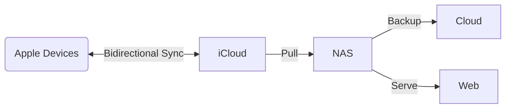

## Goals

1. Backup the entire iCloud Photo Library on my NAS.
2. Backup runs in background without any human intervention after setup.
3. Sync changes from iCloud Photo Library to the backup, including deletion and update.
4. Backup the copy on NAS to a different storage, e.g. other cloud drive or object storage.
5. Browse the copy on NAS on web page.

## What we need

1. A tool to backup iCloud Photo Library to NAS.
    - Runs in background.
    - Syncs incremental changes from iCloud Photo Library.
2. A tool to backup the local copy to other destinations.
4. A web portal to browse the local copy.

## Backup iCloud Photo Library to NAS

This is the hardest part thanks to Apple's walled garden ecosystem. But there are still two approaches to achieve the backup.
1. Push to NAS. Push the iCloud Photo Library from an Apple device has the library.
2. Pull from NAS. Pull the entire iCloud Photo Library from iCloud.

|    | Push to NAS | Pull from NAS |
| -- | ----------- | ------------- |
| **Pros** | <ul><li>Local connection to NAS, extremely fast.</li></ul> | <ul><li>No extra software on Apple device.</li><li>Works even when I am on trip.</li></ul> |
| **Cons** | <ul><li>There must be a complete copy of the iCloud Photo Library on disk, which could be a problem if the library is huge or storage optimization is enabled.</li><li>Backgroup backup might be hard due to the limitation of iOS or iPadOS, macOS is ok.</li><li>Doesn't work when the Apple device isn't in LAN.</li></ul> | <ul><li>Requires an iCloud subscription when the library is over 50GB.</li><li>Internet connection is required.</li><li>Library on iCloud might be outdated</li></ul> |

When comes down to specific softwares, here are the available choices:
1. [PhotoSync](https://www.photosync-app.com/home), an application on iOS which can sync photo to a lot of destinations, and can do conditional background sync. But it cannot sync deletion.
2. [docker-icloudpd](https://github.com/boredazfcuk/docker-icloudpd), an [icloud_photos_downloader](https://github.com/icloud-photos-downloader/icloud_photos_downloader) based docker image that can keep the local copy in sync. With extra features like notification.

I personally prefer the 'Pull from NAS' approach because:
1. If there must be a reliable copy of the entire library, I prefer it to be the one in iCloud. This also resolves potential conflict when multiple end-user devices are involved.
2. I want my library to be synced to NAS and the remote backup destination even if I am not at home.

## Backup the local copy to cloud

There are variety of softwares for backing up files from a local storage to a remote storage. Name a few of them which isn't tied to a specific storage provider. I just picked the one that seems to be the most versatile, [restic](https://restic.net/). It has a long list of supported destinations. That list becomes even longer if you have [rclone](https://rclone.org/).
1. [BorgBackup](https://github.com/borgbackup/borg)
2. [restic](https://github.com/restic/restic)

## Self-hosted photo management portal

There are plenty of softwares for this as well. I picked the one with the most fancy webui (to me), and it happens to be the most active project, [Immich](https://immich.app/). Almost all of the softwares mentioned below are meant to be a photo management solution other than a webui. I configured Immich to load my iCloud Photo Library as a read-only [external library](https://immich.app/docs/features/libraries/#external-libraries).

1. [Piwigo](https://github.com/Piwigo/Piwigo)
2. [Lychee](https://github.com/LycheeOrg/Lychee)
3. [PhotoPrism](https://github.com/photoprism/photoprism)
4. [Nextcloud Photos](https://github.com/nextcloud/photos)
5. [ownPhotos](https://github.com/hooram/ownphotos)
6. [Immich](https://github.com/immich-app/immich)

## Summary

This is how the whole thing works, arrow shows how photo data flow through the components.

